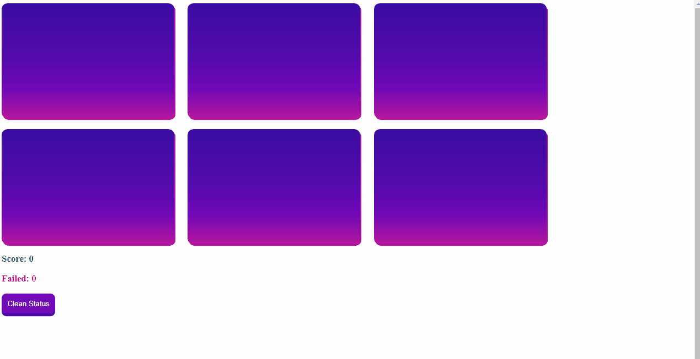

<h1 align="center" style="border-bottom: none">Memory Game</h1>

<h2 style="margin-top: 2rem" id="links">Navigation Links</h2>

  <a href="#descricao">Descrição</a>  |
  <a href="#aplicacao">Aplicação</a>  |
  <a href="#tecnologias">Tecnologias</a>  |
  <a href="#testeaqui">Teste Aqui</a>  |
  <a href="#autor">Autor</a>  

 

<h2 id="descricao" >Descrição</h2>

 É Game de memória simples que usa imagens de personagens de animes, o objetivo do jogo é encontrar o personagem que se repete duas vezes, além disso, possui um contador de score que seria tipo uma pontuação que aumenta em 10 em 10 a cada acerto e o failed que é quantidade de vezes que o usuário não encontrou os dois personagem iguais. Também, o jogo pussui um botão de zerar os status.

<h2 id="aplicacao">Aplicação</h2>
 

  

 

 

<h2 id="tecnologias">Tecnologias</h2>
 

As seguintes tecnologias foram usadas nesse mini projeto:

- [Html](https://developer.mozilla.org/pt-BR/docs/Web/HTML)
- [Css](https://developer.mozilla.org/pt-BR/docs/Web/CSS)
- [JavaScript](https://developer.mozilla.org/pt-BR/docs/Web/JAVASCRIPT)

 

<h2 id="testeaqui">Teste Aqui</h2>

<a href="https://diogofranca.github.io/memory-game/">Github pages</a>

 

<h2 id="autor">Author</h2>
Made with ❤️ by Diogo França 🎉

 

